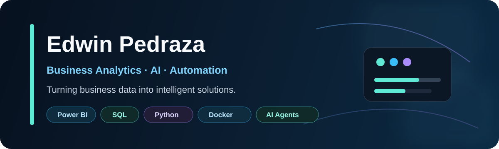
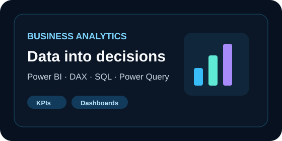
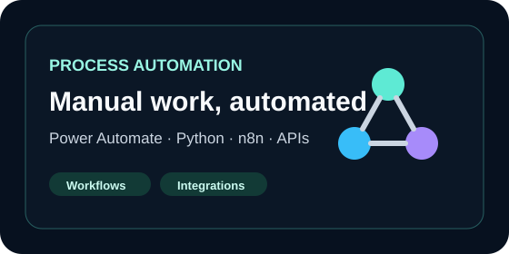
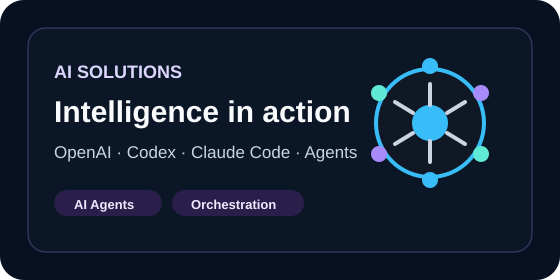
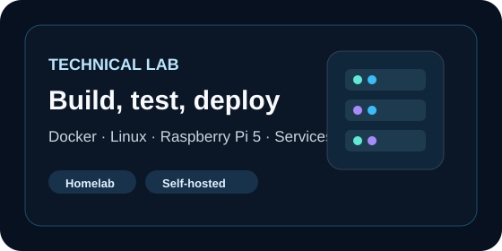
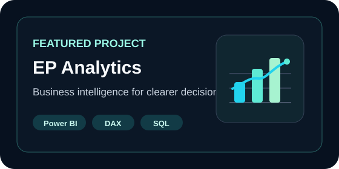
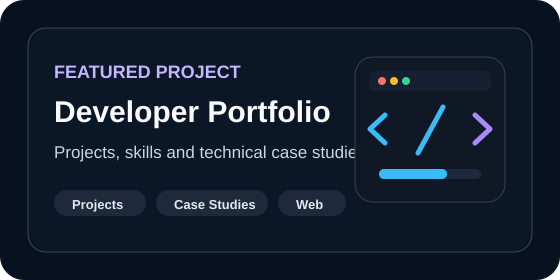
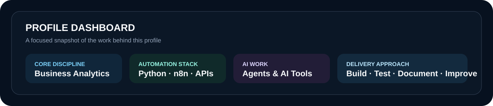

 

---

## About me

I am a **Systems Engineer and Business Analytics professional** focused on building practical solutions across analytics, reporting, process automation and AI-assisted development.

I combine business understanding with technical implementation to improve visibility, reduce manual effort and create reliable operational processes. My work includes Power BI dashboards, data modelling, workflow automation, Python utilities, API integrations and AI-enabled experimentation.

I also maintain a hands-on technical lab using Docker, Linux and Raspberry Pi 5 to deploy, test and document automation services and intelligent workflows.

---

## What I build

  

  

  

  

---

## Featured projects

### EP Analytics

A business analytics platform presenting practical solutions and content around analytics, reporting, automation and AI.

**Focus:** Business intelligence · Data analytics · Process improvement · Automation · AI-enabled solutions

[Visit EP Analytics →](https://epanalytics.cloud/en)

### Developer Portfolio

A growing project library covering analytics, automation, software development and technical experimentation.

**Focus:** Python · Automation · Data solutions · Web development · Technical case studies

[View Developer Portfolio →](https://portfolio.epanalytics.cloud/)

---

## Profile dashboard

This dashboard replaces unreliable third-party GitHub statistics with a stable, repository-hosted summary of the capabilities and delivery approach represented in this profile.

---

## Technical ecosystem

### Analytics and reporting

### Automation and integration

### AI-assisted development

### Development and lab

---

## Connect

[EP Analytics](https://epanalytics.cloud/en) · [Developer Portfolio](https://portfolio.epanalytics.cloud/) · [LinkedIn](https://www.linkedin.com/in/edwin-y-pedraza-b-/)

### Turning business data into intelligent solutions.

